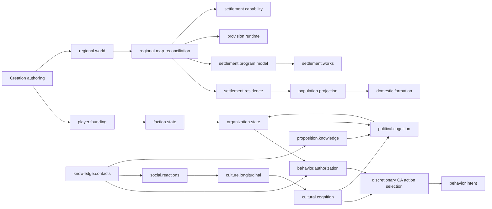
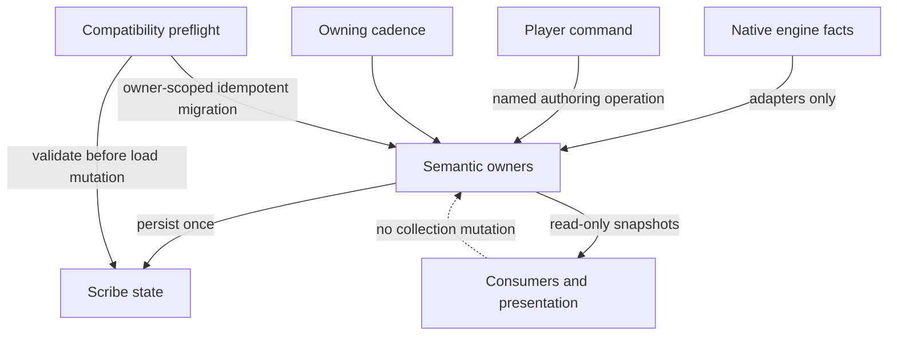

# Module ownership

Status: canonical for `1.4.1.0-alpha` / active B14
Scope: active CAO source at the B14 regional-authoring boundary

CAO modules are semantic owners. A source file, namespace, coordinator, screen,
or engine patch is not an additional owner merely because it can see the same
facts. Persisted contracts are enumerated in `SCHEMA_REGISTRY.md`; this manifest
records who owns them and how other modules may act on them.

## Extension rule

A change remains in a parent only when it shares the parent's authoritative
state, persistence boundary, lifecycle, cadence, dependency direction, causal
responsibility, and failure semantics. A new persistent family, lifecycle,
cadence, engine boundary, substantial causal process, index, failure mode, or
independently testable contract presumptively belongs to a subordinate module.
Line count alone is never a reason to split or retain code.

Coordinators call subordinate owners. They do not duplicate subordinate state.
Adapters translate represented engine facts and never invent semantic state.
Presentation reads snapshots or invokes named authoring commands; drawing a
screen is not a simulation mutation path.

## Active semantic owners

### Core, society, and campaign

| Module key | Responsibility and authoritative state | Persistence / mutation authority | Lifecycle and cadence | Dependencies → consumers | Diagnostics and extension rule |
|---|---|---|---|---|---|
| `campaign.compatibility` | Campaign boundary, schema manifest, upgrade receipts, emitted-payload validation and preflight decision | `CACampaignCompatibilityWorldComponent` owns manifest/receipts; the compatibility kernel streams and seals the complete save candidate | Validate and SHA-256 seal after `ScribeSaver.FinalizeSaving` but before SafeSaver swap; verify before load; guard save while blocked | Scribe/SafeSaver/save loader → every persisted owner | `CompatibilityPreflight`; new migration logic stays here, semantic migrations stay with their owner |
| `behavior.authorization` | Pure permission decision from behavior catalog and supplied context | No persistent state; `CABehaviorGate` is the only authorization decision path | At action origination and native-execution validation | settings, intent context, knowledge, authority → all behavior originators | `BehaviorAuthorization`; new behavior definitions are additive, new authority domains are subordinate context owners |
| `behavior.intent` | Owned job intent and recent decision observations | `CABehaviorIntentMapComponent`; register, observe, unregister, prune | Engine job events; bounded 250-tick prune | authorization + native jobs → combat, home, settlement work, support | behavior census and B10 receipts; intent lifecycle changes stay here |
| `knowledge.contacts` | Session contact facts and durable welfare accountability by pawn, evidence path, age and uncertainty | `KnowledgeMapComponent`; contacts are session-only, while `CA_accountability` is the saved `map.welfare-knowledge` payload | observation 30 ticks; relay 60; expiry on relay pass; accountability on represented welfare events | battlefield perception/comms → behavior and social interpretation | `KnowledgeObservation`, `KnowledgePropagation`; observation partitions candidates by faction, caps expensive pair checks and defers overflow |
| `authoring.ontology` | Semantic-kind contracts, production social-referent, twenty-four-question Culture and concrete-practice vocabulary, complete Political Order questions/presets, represented-institution comparison, category cardinality policy, and control-to-consumer contracts | No persistent state; immutable production registries and copy-on-apply profile kernels | Authoring projection, validation, complete preset application, deterministic generation, and derived identity/account | represented mechanics + model owners → Culture/Political Order composers, coverage, and receipts | `AuthoringOntologyProjection`; additions require a coherent construct, production source, consumer, distinct conduct or mechanism, and coverage receipt |
| `society.authoring` | Twenty-two built-in and reusable user recipes, each with independent Society identity and metadata, one Culture reference or snapshot, and one frozen complete Political Order composition | `CASocietyPresetLibrary` owns validation and rollback-safe atomic copy-on-apply; `CAUserSocietyProfile` persists deep two-component snapshots only in global settings, outside campaign state | Player founding, established-faction authoring, or new-society placement in Starting Region | existing Society section → canonical faction `CACulture` and `CAPoliticalBeliefs` → separate editors and consumers; Starting Region separately creates ordinary faction, settlement, population-source, and map-assignment state | A Society preset is an initializer, not runtime ownership; both components validate before either canonical owner changes, an exceptional commit restores both owners, and the recipe never writes Ideoligion, founding terms, represented institutions, settlement type, or event history |
| `culture.authoring` | Twenty-two complete historical/social component presets across the `Social forms` and `Historical cultures` catalog groups, with reference region and period as metadata, plus one overall-disagreement default, per-value disagreement under More, deterministic randomization, and missing-row completion | Built-ins are immutable; `CAUserCultureProfile` persists component snapshots in global settings; `CACulturePresetLibrary` and `CACultureAuthoringKernel` copy values directly into the destination `CACulture` | Explicit authoring or pre-realization generation only | question registry + destination Culture → founding/established editors and non-player faction generation | Manual, component-preset, profile, random, and completion paths remain one Culture object; player state is never silently randomized and Culture presets do not imply a Political Order |
| `social.meaning` | Production factual-subject registry and exact question adapters | No persistent state; unmatched former values remain Culture-owned legacy evidence | Invoked on represented facts and supported migration/history | factual context + exact adapter → reactions, question evidence and Culture history | Subjects are factual referents, never question or practice identities |
| `social.reactions` | Per-pawn/population/organization reactions | `CASocialReactionWorldComponent`; `RecordFact` and retention/aggregation preparation | Event ingress; bounded retention before aggregation | meaning kernel + acts → Culture longitudinal owner | `SocialInterpretation`, `SocialAggregation`; new fact adapters may not write the list directly |
| `culture.longitudinal` | Local lived Culture question distributions, concrete practices, observations, legacy evidence and transition history | `CACultureLongitudinalMapComponent`; direct-question measurements persist in the owning `CACulture` observation ledger and transition kernels run only from its evaluation | Daily, map-staggered | reactions, population, programs, organizations → cultural cognition and history | `CultureLongitudinalUpdate`; direct measurements retain position, spread, represented population, continuity and source identity; new evidence adapters remain pure |
| `cultural.cognition` | Persistent pawn psychology, question-specific private/public attitudes, separated attention/prior/social-pressure/observation facts, sparse influence edges, and bounded schedules | `CACulturalCognitionWorldComponent` schema 2; materialization, stable uptake from Culture observations, radius-bounded contact lookup, target-edge indexes and owning social/cleanup/long ticks | On-demand materialization; 2,500-tick social; 60,000-tick edge expiry; 600,000-tick stale-identity cleanup | Culture + Ideoligion + represented pawn/network/evidence facts → behavior appraisal plus narrow cultural-fit and observed-contact projections | `CulturalCognition`; salience cannot manufacture conviction, norm pressure cannot manufacture enforcement, source confidence cannot manufacture knowledge confidence, and visibility cannot compress expression |
| `political.cognition` | Pawn political attitudes, family-controlled issue links and faction-bounded coalitions | `CAPoliticalCognitionWorldComponent`; political and coalition kernels plus transient pawn/attitude/faction/issue/organization indexes | 2,500-tick bounded position update; 60,000-tick coalition update | Culture, psychology, Ideoligion, material interest, institutions, threat, indexed propositions and influence → politics/organizations | `PoliticalCognition`, `PoliticalCoalition`; normative Political Order and represented institutions remain separate owners |
| `proposition.knowledge` | Propositions, holders, sources, channels, contradictions, access, confidence, transmission, custody, decay and research receipts | `CAPropositionKnowledgeWorldComponent`; observation/report/research ingress and owning knowledge ticks | Event ingress; 60,000-tick native/institution sync; 600,000-tick decay | direct observation, testimony, native research, settlement research, organizations → cognition, politics and behavior | `PropositionKnowledge`; direct observation bypasses access norms and novelty never determines truth |
| `faction.state` | Established faction Culture, normative Political Order, and represented institutions | `CAFactionStateWorldComponent`; ensure/find and explicit authoring/materialization paths | World creation/load and represented changes | faction authoring + native factions → regional settlements, Culture, politics | compatibility owner receipt; Political Order and represented institutions retain separate writes and consumers |
| `player.founding` | Confirmed founders' inherited Culture, Ideoligion link, Political Order, and adopted founding arrangement | `CAPlayerFoundingWorldComponent`; confirmation/materialization only | Colony creation, one founding application, then historical runtime state | creation flow → faction state and organization | founding receipts; later institutional history does not rewrite the founding plan |
| `organization.state` | Organizations, offices, membership, customs, security practice, agreements, cases, offers, gatherings, frontier holdings, legitimacy and sanction history | `CAOrganizationWorldComponent`; named ensure/agreement/record/membership/sanction operations | 2,500-tick world pulse, 60,000-tick legitimacy sync, plus explicit events | faction/regional/relations/cognition → politics, settlement programs, transactions and behavior appraisal | `OrganizationLookup`, `InstitutionalLegitimacy`; additions sharing this world ledger remain additive, independent ledgers do not |
| `organization.relations` | Typed organization relations and facility holdings | `CAOrganizationRelationsWorldComponent`; typed relation/holding operations | Explicit formation/change/dissolution events | organizations + settlement facts → political effects, roads, programs | compatibility receipt; consumers never mutate relation collections |
| `transactions` | Parties, credit terms, transactions, debts | `CATransactionLedger`; named transaction/debt operations | Economic events and settlement materialization | organizations + exchange → commerce capability, political/economic consumers | transaction receipts; new financial lifecycles become subordinate models |

### Region, settlement, and home

| Module key | Responsibility and authoritative state | Persistence / mutation authority | Lifecycle and cadence | Dependencies → consumers | Diagnostics and extension rule |
|---|---|---|---|---|---|
| `regional.world` | Realized regions, settlements, world tendencies, geography bindings, population and program-bearing settlement records | `CARegionalWorldComponent`; plan materialization and explicit runtime reconciliation | World creation/load and represented settlement events | starting-region authoring + world facts → map generation and settlement owners | compatibility receipt; creation algorithms never rerun over an established campaign |
| `regional.map-reconciliation` | Refreshes live counts and invokes subordinate settlement owners | No independent persistence; `CARegionalSettlementMapComponent` coordinates only | Map load/generation and staggered 7,500-tick pass | regional record + one shared map scan → domestic, programs, provision, security, capability | `FullMapScan`; no subordinate state may move into this coordinator |
| `settlement.environment` | Pure site-support derivation and RimWorld environment adapter over the represented tile or projected constituent cells | No independent persistence; realized land capacity stays with the regional settlement and the live environmental snapshot stays with `settlement.context` | Starting-region realization and staggered context refresh | biome, seasonal temperature, growing period, plant/forage support, disease, mutators, terrain, and projected source identity → population capacity, frontier suitability, settlement details, and spatial planning | `B14SettlementEnvironmentReceipts`; environment constrains physical support and ranks authorized behavior but cannot author Culture, politics, institutions, programs, or permission |
| `settlement.composition` | Authored population-group composition and assignment policy | Population groups and assignments inside `CARegionalSettlementRecord`; composition commands | Authoring/materialization; explicit residence events thereafter | regional authoring → population projection and domestic formation | B10 composition receipts; pure authoring remains separate from runtime projection |
| `population.projection` | Resolves live pawns from persisted typed residence assignments | No independent state; `CAPopulationProjection` reads settlement residence authority | On materialization/reconciliation/query | residence assignments + map pawns → domestic, programs, Culture | `PopulationResidentLookup`; retain reconstruction until campaign evidence justifies an event-maintained index |
| `settlement.residence` | Typed resident entry, assignment, transfer, exit, and population-group binding | `CASettlementResidenceState` mutates `residenceAssignments` in the settlement record | Native pawn/faction events and explicit settlement materialization | population facts → projection and domestic units | residence receipts; proximity/faction are evidence inputs, not authority |
| `domestic.state` | Stable domestic-unit identity, memberships, provision demand, transition history | Domestic collections inside `CARegionalSettlementRecord`; normalization and typed transition operations | Formation, join, split, merge, absence, exit, death, dissolution | residence + native represented relations → provision consumers | B10 domestic receipts; retain current state family |
| `domestic.formation` | Reconciles represented relationships into domestic transitions | No independent persistence; `CADomesticUnitFormation.Reconcile` is the sole transition coordinator | Settlement reconciliation | residence adapter → domestic state | `DomesticUnitTransition`; relationship adapters remain subordinate |
| `domestic.residence-adapter` | Adapts typed residents and native relationships | No state and no mutation | On domestic lookup | population projection → domestic formation/provision access | `DomesticUnitLookup`; adapter may not admit pawns by proximity alone |
| `provision.arrangement` | Provision operator kind/identity, funding, stock, access, maintenance, operating state | `CAProvisionArrangement` in settlement record; authoring/causal derivation paths | Settlement authoring, materialization, and runtime validation | population/order/program facts → materialization and access | B10 provision receipts; operator identity remains exact |
| `provision.operator` | Resolves typed domestic, population, organization, and pawn operators | No state | On materialization and reconciliation | domestic/residence/organization → provision runtime | `ProvisionResolution`; add operator adapters here, not in the materializer |
| `provision.funding` | Resolves represented funding and taxation evidence | No state | On provision reconciliation | organization/program facts → provision runtime | `ProvisionResolution`; independent funding history belongs to transaction owner |
| `provision.material` | Observes or plans exact material nodes and starting stock | Receipts live in settlement program assets and starting stock; adapter has no second truth | Materialization and reconciliation | map things + program assets → provision runtime | `ProvisionResolution`; atomic materialization remains with settlement works |
| `provision.access` | Tests actual consumer access to exact nodes | No state | On reconciliation/query | residents, domestic units, map reachability → provision operating state | `ProvisionResolution`; access does not infer membership |
| `provision.runtime` | Ordered validation across operator, funding, material, and access owners | Mutates only provision/program runtime status fields | Settlement reconciliation | subordinate provision owners → program/runtime consumers | `ProvisionResolution`; remains a coordinator, never a generic settlement owner |
| `settlement.program.model` | Program registry, entries, operational facts, material requirements, runtime status | `CASettlementProgram` and entries in settlement record | Authoring, realization, represented operational change | settlement needs/order → authoring, assets, works, capability | schema and B10 program receipts; registry additions are additive |
| `settlement.program.authoring` | Converts exact authoring facts into program entries | No independent state | Creation/explicit authoring | UI commands and causal kernels → program model | B10 program receipts; UI cannot call runtime reconciliation |
| `settlement.program.assets` | Stable receipts for placed zones/things and their exact program role | `programAssets` in settlement record; asset registry operations; entry ID lists are synchronized read views and are not saved in B11 | Materialization, native construction completion, destruction/rebuild | programs + map engine → works, provision, capability | B10 asset receipts; relation holdings change only through the relations owner's atomic rebind API |
| `settlement.works` | Program materialization plus repair, rebuild, and research work receipts | `CASettlementWorksMapComponent`; atomic placement/work receipt operations | 2,000-tick pulse and native job/construction events | program runtime, assets, behavior gate → map jobs and capability history | `SettlementRepair`, `SettlementRebuilding`, `SettlementResearch`; one cadence owner retained because transaction and rollback are shared |
| `settlement.capability` | Persisted capability assessments and source signatures | Capability list in settlement record; `CASettlementCapabilities.Reconcile` | Settlement reconciliation | domain evidence adapters → inspection and downstream role derivation | B10 capability receipts; common assessment remains separate from domain adapters |
| `settlement.capability-evidence` | Domain-specific medical, production, logistics, civic, research, security, commerce, and communication evidence | No state | On assessment | represented engine/program/history facts → common assessment kernel | no generic god adapter; new domain evidence becomes a sibling adapter |
| `settlement.wealth` | Pure summary of represented material programs and knowledge era | No state; `CASettlementWealth` | Creation/reconciliation derivation | program facts → settlement summary | no profile key; remains pure and must not regain axis mutation |
| `home.program` | Player-authored space programs and resident roster intent | `PlannedUseMapComponent` | Direct authoring plus native zone/building events | player commands → home planning, storage, settlement context | home receipts; inventory projection is owned separately by `CAStorageProgramMapComponent` |
| `home.prerequisite` | Retained exact material demand and owned source evidence | `CAHomePrerequisiteMapComponent` | Home planner demand; 30-tick safety validation while active | home planning + knowledge → spatial/material work | home receipts; it owns no general inventory state |
| `home.autonomous` | One cadence coordinating demand detection, plan selection, spatial search, construction observation, veto, and receipts | `AutonomousHomeMapComponent` | Initial 300, then 600 ticks; native cancel/build events | programs, prerequisites, behavior, spatial facts, settlement environment, and task-owned pattern evidence → blueprints | `AutonomousHomePlanning`, `SpatialSearch`; survival and native validity close before functional adjacency, circulation, expansion, environment, history, and visual order rank candidates; no style mode or copied layout exists |
| `spatial.initiative` | Non-home spatial objectives, ownership, veto, and built-room/storage receipts | `CASpatialInitiativeMapComponent` | Initial 300, then 600 ticks; native zone/build events | programs + behavior → spatial work | spatial receipts; remains separate from home state |
| `settlement.context` | Derived settlement placement context, represented environmental and habitat-requirement snapshot, and source signature | `CASettlementPlanningContextMapComponent` schema 3 | Staggered 7,500-tick refresh and dirty events | pawns, programs, built facts, projected source tiles, biome, climate, ecology, cultivable ground, required functions, food route, and capability floor → home candidate ranking and environmental receipts | derived cache; schema-2 state refreshes additive habitat fields from current represented facts; authority and invalidation are explicit in the component |
| `settlement.layout` | Persisted settlement graph/layout snapshot | `CARegionalSettlementRecord.layout` under `CARegionalWorldComponent`; `CASettlementGraphMapComponent` owns only runtime dirty scheduling | Dirty events; one stale settlement per 500-tick pass writes through the regional owner | regional/map geometry → roads, assault approach, planning | `model.settlement-layout` is the sole persisted contract; dirty set is runtime-only |

### Operational and engine-bound owners

| Module key | Responsibility and authoritative state | Cadence / event source | Notes |
|---|---|---|---|
| `combat.intent-and-recovery` | Combat episodes, immediate recovery, drafted initiative, owned tactical intent | 5/30/60-tick bounded combat passes and native job/stance/damage events | Combat facts remain actor-local; topology/log components are subordinate evidence owners |
| `combat.topology` | Dirty topology facts and diagnostic reference artifacts | Thing/terrain/fire events; bounded snapshot cadence when diagnostic recorder is armed | Engine adapter does not create social state |
| `combat.spatial-log` | Persisted combat spatial concerns and battle-log links | Bullet/battle-log events | Diagnostic/evidence owner only |
| `welfare.knowledge-and-support` | Expected-person facts, accountability, and owned support requests | 60-tick request pass; 600-tick accountability; native rescue evidence | Knowledge and support have separate state lists under one map knowledge boundary |
| `operational.access` | Persisted player operational-access policy and retry state | 60-tick game pass and forbid/drop-pod events | Maintains represented accessibility, not ownership |
| `patrol-and-task-force` | Persisted patrol circuits/assignments and regional task forces | patrol 250/1,500; task force 250 | Separate owners because lifecycle and semantic state differ |
| `storage` | Persisted storage-program and inventory-storage projections in `CAStorageProgramMapComponent` | 250-tick audit plus zone events | `PlannedUseMapComponent` remains authoritative only for player space programs |
| `toxic-waste` | Inventory, capacity, freezing, relocation, transport, destination, consequence, and response records | active-job observation each tick; 2,500-tick refresh; native haul/job events | Cohesive lifecycle owner; not split by record count |
| `world-generation` | Starting-region pending authoring, regional projection kernels, generation patches, renderer adapters | creation pages and long events; map-generation engine hooks | Pending authoring may reset; realized region state belongs to `regional.world` |
| `presentation` | Creation screens, inspectors, gizmos, overlays, diagnostics | UI draw/input events | Read-only unless the player invokes a named authoring command |

## Required B11 boundary decisions

| Review surface | Decision | Evidence and result |
|---|---|---|
| Axis materialization | **RETAIN WITH SMALL CLEANUP** | The only mutator had no callers and wrote belief conflicts outside the political-effects owner. It was removed. `SettlementWealthModule.cs` now contains only the live pure summary. No axis facade remains to regain deleted responsibilities. |
| Domestic units | **COHESIVE / RETAIN** | State, formation, residence adaptation, and provision consumption already have separate authority and lifecycle boundaries. |
| Settlement capability | **COHESIVE / RETAIN** | Common assessment and eight domain evidence adapters remain separate. |
| Provisioning | **COHESIVE / RETAIN** | Arrangement state, operator, funding, material, access, and runtime coordinator are explicit siblings. |
| Settlement programs | **COHESIVE / RETAIN** | Model, causal authoring, assets, runtime validation, and works/materialization remain distinct. |
| Settlement composition | **COHESIVE / RETAIN** | Pure composition and live pawn projection are separate classes; no behavior change is justified. |
| Social meaning / Culture | **COHESIVE / RETAIN** | Pure registry/resolution, reaction persistence, aggregation, and longitudinal transition are separate. |
| Autonomous home / development | **RETAIN WITH OBSERVABILITY** | One persisted component owns one cadence and shared veto/rollback semantics. Spatial search has its own profile boundary; no independent state owner warranted extraction. |
| Behavior, knowledge, context, organization | **RETAIN WITH SMALL CLEANUP** | Central owners remain coherent. Organization key lookup was the demonstrated repeated reconstruction and now has one derived index. |

No decision was based on source length. No decomposition requirement remained
after removing the dead axis mutator and centralizing the repeated organization
lookup.

## Authorized mutation paths

| State | Only authorized writer | Authorized callers |
|---|---|---|
| Campaign manifest and migration receipts | `CACampaignCompatibilityWorldComponent` | preflight/load owner migrations |
| Behavior intents | `CABehaviorIntentMapComponent` | behavior gate observations and native job lifecycle adapters |
| Known facts | `KnowledgeMapComponent` | perception, communication, welfare fact adapters |
| Cultural psychology, attitudes and influence | `CACulturalCognitionWorldComponent` | materialization, represented social contact and its owning cadences |
| Political attitudes, issue links and coalitions | `CAPoliticalCognitionWorldComponent` | political formation and coalition cadences |
| Propositions and research receipts | `CAPropositionKnowledgeWorldComponent` | direct observation, qualified reports, native research and settlement research completion/failure |
| Social reactions | `CASocialReactionWorldComponent.RecordFact` | registered fact adapters |
| Local Culture history | `CACultureLongitudinalMapComponent` through `CACultureHistory` | its daily evidence evaluation only |
| Faction state | `CAFactionStateWorldComponent` | creation/materialization and represented changes |
| Founding state | `CAPlayerFoundingWorldComponent` | confirmed creation flow |
| Organizations, legitimacy and sanctions | `CAOrganizationWorldComponent` named operations | formation, explicit events, sanction ingress and owner cadence |
| Organization relations/holdings | `CAOrganizationRelationsWorldComponent` | typed relation/holding operations |
| Regions and settlements | `CARegionalWorldComponent` | confirmed creation, engine materialization, explicit runtime reconciliation |
| Regional reservation registry | `CARegionalWorldComponent` from authoritative plan footprints | load/register reconciliation; subordinate WorldObjects never originate ownership |
| Residence | `CASettlementResidenceState` | materialization and native residence event adapters |
| Domestic units | `CADomesticUnitFormation` plus normalization helpers | regional settlement reconciliation |
| Provision status | `CAProvisionRuntimeResolver` | regional settlement reconciliation |
| Settlement programs/assets/work | program authoring, asset registry, and works component respectively | explicit authoring, materialization, native construction/job events |
| Capability assessments | `CASettlementCapabilities.Reconcile` | regional settlement reconciliation |
| Home/spatial plans | their owning map components | player authoring, owning cadence, native cancel/build events |

## Derived indexes and caches

| Index/cache | Authority | Owner and rebuild | Invalidation / stale handling | Save policy / diagnostic |
|---|---|---|---|---|
| Organization key index | persisted `organizations` list | `CAOrganizationWorldComponent`; lazy build and post-load rebuild | add updates; removal invalidates; rebuild keeps first duplicate for validation to report | runtime-only; `OrganizationLookup` hit/miss |
| Social reactions by pawn | persisted `CASocialReactionWorldComponent.reactions` list | `CASocialReactionWorldComponent`; lazy build after load or retention and incremental add | record inserts in tick order; retention marks the index dirty; the next query rebuilds from authority | runtime-only; not serialized; Culture moral-evidence lookup only |
| Effective behavior profile cache | behavior catalog + settings/autonomy/role/spatial revisions | `CAEffectiveBehaviorProfileCache` | explicit revision hooks clear pawn/map/all entries | runtime-only; behavior census |
| Settlement layout dirty set | persisted regional-record layout plus engine geometry | `CASettlementGraphMapComponent` schedules invalidation; `CARegionalWorldComponent` owns the written layout | spawn/despawn/geometry events mark keys; one key rebuilt per pass | runtime-only dirty queue; no second persisted layout owner |
| Settlement planning context | current pawns, programs, built facts, exact projected biome/climate source tiles, and derived habitat requirements | `CASettlementPlanningContextMapComponent` schema 3 | staggered refresh and explicit dirty calls; source signature rejects stale use | persisted derived snapshot with source signature; context, environment, and habitat receipts |
| Regional rock types by tile | world natural-rock definitions | `CARegionalProjectionMapComponent` | component/map lifetime; missing entries rebuild once | runtime-only; generation audit |

Resident, population-group, domestic membership, officeholder, security,
provision-node, program-asset, and known-fact joins remain with their
authoritative saved owners. Organization keys and per-pawn social reactions
have runtime-only indexes because both now have repeated hot lookups and a safe,
complete invalidation path. `PopulationResidentLookup`, `DomesticUnitLookup`,
and `SocialAggregation` collect evidence for any later index decision on the
remaining joins.

## Cadence and repeated-update inventory

| Owner / source | Cadence or trigger | Activation and bounded work | Mutated state | Profile key |
|---|---|---|---|---|
| Act ledger | 2,500 ticks | saved acts; report, judge, cull bounded ledger | reports and act retention | none |
| Native aperture | `TickRare` | spawned aperture only | shutter/open state and temperature exchange | none |
| Arrangements | 250 ticks | saved arrangements × current colonists | membership cleanup | none |
| Assault approach | 600 ticks | player home and current layout | approach state | none |
| Audible cues | 60 ticks | enabled reports; bounded fact lists | relayed/expired cues | none |
| Autonomous home | 300 initial / 600 | player home, one objective, represented climate, and current exposure | home plan/receipt state | `AutonomousHomePlanning`, `SpatialSearch` |
| Battlefield parley | 60 ticks | active missions/envoys | mission progress | none |
| Behavior intent | 250 ticks | owned intents and recent decisions | expiry only | `BehaviorAuthorization` at creation |
| Bridge decay | 2,500 ticks | full terrain grid when enabled | represented bridge collapse | `FullMapScan` inventory only; no duplicate found |
| Buddy carry | 250 ticks | live humanlike pawns when enabled | assisted-carry effects | none |
| Combat aftermath | 2,500 ticks | bounded accountability records | expiry only | none |
| Colony context | 120 ticks | player colonists and live jobs | derived context snapshot | none |
| Corpse discipline | 1,800 ticks | unburied humanlike corpses | forbiddance/response work | none |
| Culture history | 60,000 + map stagger | player and regional settlements | Culture transitions | `CultureLongitudinalUpdate` |
| Cultural cognition | materialize on demand; social 2,500; long 600,000 | at most twelve represented pawns per social pass and at most eight saved question-specific influence neighbors per pawn | psychology, attitudes, influence edges; read-only evidence for organization appraisal | `CulturalCognition` |
| Organization legitimacy | 60,000 | represented organizations and read-only cognition evidence | organization-owned legitimacy appraisals | `InstitutionalLegitimacy` |
| Political cognition | political 2,500; coalition 60,000 | bounded represented pawns, issue registry and faction partitions | political attitudes, issue links, coalitions | `PoliticalCognition`, `PoliticalCoalition` |
| Proposition knowledge | event ingress; knowledge 60,000; long 600,000 | represented propositions, native research, organizations and bounded decay | propositions and research receipts | `PropositionKnowledge` |
| Enemy restraint | 250 ticks | live hostile humanlikes when enabled | native restraint jobs | none |
| Equipment transition | 30 ticks | enabled transition records/pawns | transition state | none |
| Fire response | 120 ticks | current fires and eligible pawns | authorized jobs | none |
| Hold orders | 45 ticks | held pawns only; disabled path clears | hold validation | none |
| Home prerequisite | 30 while demand active | owned source IDs only | demand/source validation | `AutonomousHomePlanning` parent |
| Immediate combat recovery | 60 ticks | tracked episodes and live pawns | recovery episode state | none |
| Drafted combat initiative | projectile 5; draft 30; cleanup 60 | live projectile/pawn lists, enabled gates | actor-local combat intent | none |
| Knowledge | observe 30; relay/expiry 60 | faction-partitioned candidates; 2,048 expensive pair checks per observation pass with rotating deferral; bounded fact lists | knowledge facts | `KnowledgeObservation`, `KnowledgePropagation` |
| Moving fire | 120 ticks | tracked transition/penalty state | cleanup only | none |
| Operational access | 60 ticks | enabled maps and scoped things | access policy projections | `FullWorldScan` inventory only |
| Organization | 2,500 ticks | organizations, agreements, background budget | organization/relations effects | `FullWorldScan`, `OrganizationLookup` |
| Patrol | step 250; pulse 1,500 | persisted circuits/assignments | patrol state/jobs | none |
| Raid response | fast 30; main 250 | hidden/shelter and enabled response state | owned combat/shelter intent | none |
| Regional settlement reconciliation | staggered 7,500; load/generation | one shared lister traversal, then each settlement owner once | settlement runtime facts | `FullMapScan` plus subordinate keys |
| Road expansion | 3,000 + map stagger | active projects and relation-backed routes | project state/jobs | none |
| Settlement layout | 500 | one dirty settlement | saved layout | none |
| Settlement context | 7,500 + map stagger | only populated/program maps | context snapshot | none |
| Settlement works | 2,000 | active records/programs; one work origin per pass | repair/rebuild/research receipts | `SettlementRepair`, `SettlementRebuilding`, `SettlementResearch` |
| Spatial combat memory | observe 60; prune 600 | threat-aware humanlikes and bounded memory | combat memory | none |
| Spatial initiative | 300 initial / 600 | authorized player map objectives | spatial plan/receipts | none |
| Squad support | 90 | enabled support behaviors and bounded taskings | support intents | none |
| Storage | 250 | owned projection records | projection validation | none |
| Sustenance | 2,000 | player colonists on loaded maps | weight/fullness history | `FullWorldScan` inventory only |
| Task force | 250 | present hostile pawns grouped by faction | task-force state | none |
| Toxic waste | active job each tick; refresh 2,500 | one active relocation plus bounded ledgers | lifecycle objective and records | none |
| Trap memory | 2,500 when nonempty | bounded spring records | expiry only | none |
| Welfare support | 60 | bounded active requests | request lifecycle | none |
| Withdrawal | 30 when plans exist | persisted withdrawal plans | integrity repair only | none |

Repeated Harmony and long-event owners are event-driven: compatibility load,
save, and new-game hooks; construction completion/cancel/destruction hooks for
home, storage, spatial initiative, and settlement works; combat job, stance,
damage, projectile, topology, and battle-log hooks; regional map-generation and
renderer hooks; pawn residence/faction hooks; and creation-page authoring hooks.
Each calls the semantic owner named above. Long-event callbacks are limited to
mod initialization, pending-authoring diagnostics, creation preview work, and
explicit developer exercises. They introduce no independent cadence owner.

The B11 scan correction replaces one `map.listerThings.AllThings` traversal per
settlement with one traversal per regional reconciliation. Other full-grid or
full-world passes are either low cadence, engine-generation work, diagnostic,
or awaiting retained-campaign profiler evidence. No ordinary inspection screen
invokes authoritative reconciliation.

## Future batch impact record

Every post-B13 implementation batch records:

| Record | Required fields |
|---|---|
| Module impact | parent owner; additive or subordinate; persistent-state, lifecycle, cadence, and dependency impact |
| Campaign compatibility | none; additive default; explicit migration; future-only behavior; or operator-authorized destructive incompatibility |
| Performance impact | operations/cadence; bounded work; scans; index/cache effect; profiler keys |

The manifest changes when semantic ownership changes, not whenever a file is
renamed.
